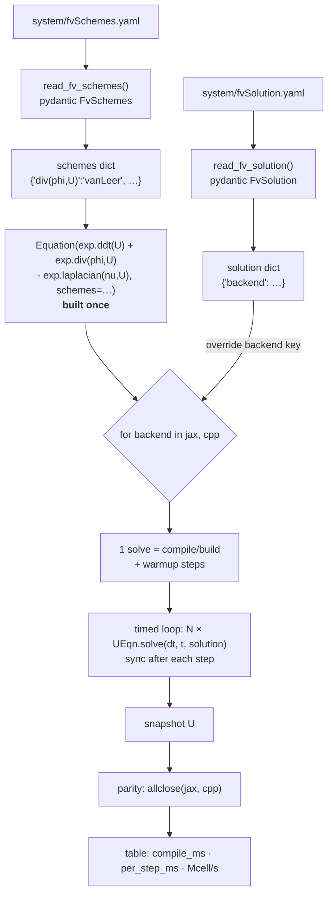
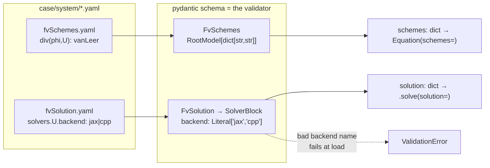
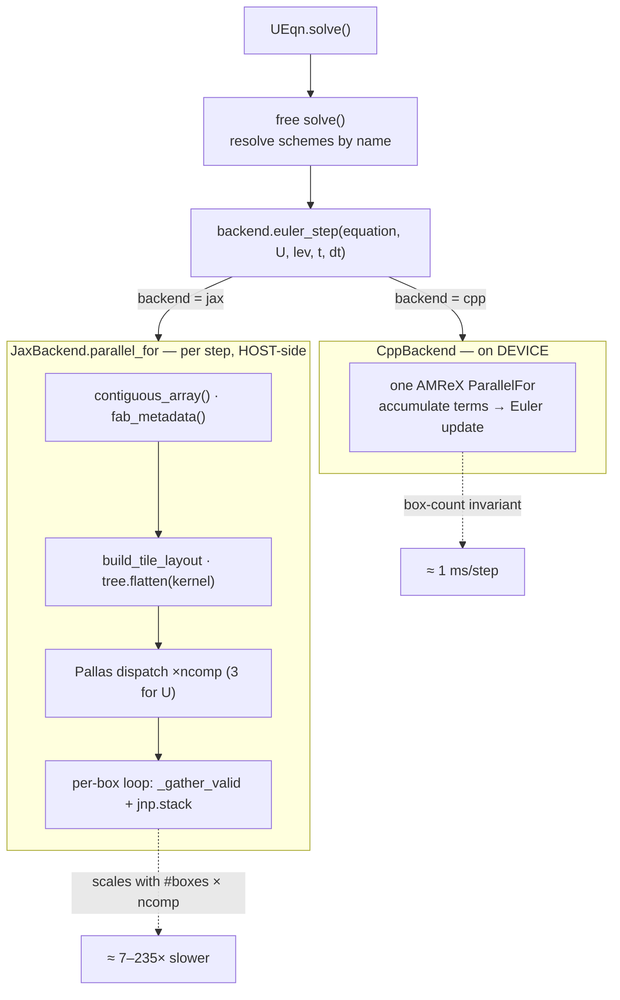
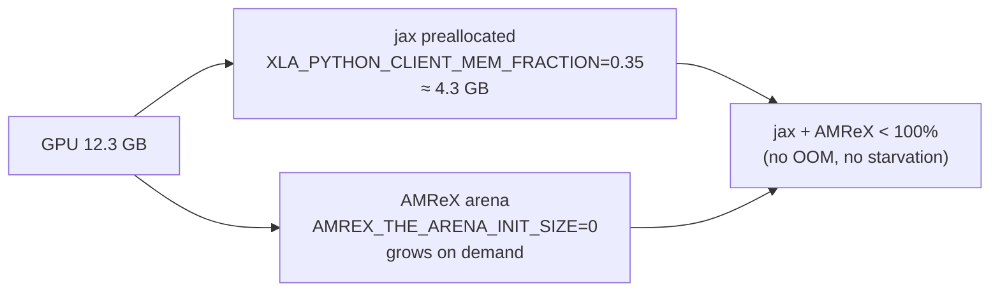

<!--
SPDX-License-Identifier: MIT
SPDX-FileCopyrightText: 2023 - 2026 NeoN authors
-->

# blockAMR backend benchmark (`jax` vs `cpp`)

Compares the two explicit-path backends of the blockAMR `Equation` API on the
**same** equation, with discretisation (`fvSchemes`) and solution approach
(`fvSolution`, incl. the backend) read from disk. Parameterised over cell count
and max grid size; scheme is set in the case file.

```bash
python bench_backends.py --n-cell 32 64 --max-size 16 32 64 --steps 100
```

## Harness flow



## Data loading (pydantic over YAML)



## Backend dispatch — where the cost is



## GPU memory split (shared device)



## Findings (RTX-class 12 GB, `vanLeer` div + central laplacian, ncomp=3)

| n_cell | max_size | boxes | jax ms/step | cpp ms/step | jax slowdown |
|-------:|---------:|------:|------------:|------------:|-------------:|
| 64 | 16 | 64 | 254.9 | 1.08 | 236× |
| 64 | 32 |  8 |  37.8 | 0.87 |  43× |
| 64 | 64 |  1 |   8.9 | 1.21 |   7× |

jax per-step scales with **box count** (host-side per-box Python in
`parallel_for`); cpp is box-count invariant (one on-device `ParallelFor`). Parity
holds (`allclose`, jax≈cpp) on every row. Improving jax means batching the
`ncomp` dispatches and moving the per-box gather/stack onto the device.
