# CI/CD Pipeline Graph

```mermaid
flowchart TD
    repo["GitHub repo: exasim-project/NeoN"]

    pr["Pull request events"]
    push["Push to develop/main"]
    tag["Tag push v* / v*.*.*"]
    schedule["Scheduled runs"]
    manual["Manual workflow_dispatch"]

    repo --> pr
    repo --> push
    repo --> tag
    repo --> schedule
    repo --> manual

    subgraph labels["PR labels that change behavior"]
        skipBuild["skip-build: skip build/test jobs"]
        skipCache["Skip-cache: disable build cache"]
        fullCI["full-ci: sanitizer + AWS paths, Ubuntu skips normal configure step"]
        autoFix["auto-fix: commit pre-commit fixes"]
        benchmarkLabel["benchmark: LRZ benchmark pipeline"]
        skipChangelog["skip-changelog: skip changelog check"]
        skipGPU["skip-nvidia / skip-amd / skip-intel: skip LRZ vendor jobs"]
    end

    pr -. controls .-> labels

    subgraph github_cpu["GitHub Actions: CPU / host CI"]
        ubuntu["Build NeoN on ubuntu\nclang/gcc x develop/profiling/production\nbuild, ctest -E bench, install"]
        macos["Build NeoN on MacOs\ngcc/g++ develop\nGinkgo/OpenMP/threads off, ctest"]
        windows["Build NeoN on Windows\nMSVC develop\nMPI/Ginkgo/Umpire off, test target"]
        staticChecks["Static checks\npre-commit, IWYU compile DB,\nclang-tidy, changelog, FIXME"]
        sanitizer["Build NeoN with sanitizer\nfull-ci gated\nASAN/UBSAN/MSAN matrix"]
        neofoamCPU["NeoFOAM Integration Test\ncheckout NeoFOAM branch or develop fallback\nOpenFOAM 2406 build + ctest"]
        docs["Build documentation\nSphinx/Doxygen build\nGitHub Pages deploy + PR comment"]
        pdf["Draft PDF\nJOSS paper PDF artifact"]
        wheels["Python wheels\nCPU wheels, manual GPU CUDA wheels,\nPyPI / GitHub Release publishing"]
    end

    pr --> ubuntu
    push --> ubuntu
    schedule --> ubuntu
    manual --> ubuntu

    pr --> macos
    push --> macos
    schedule --> macos
    manual --> macos

    pr --> windows
    push --> windows
    schedule --> windows
    manual --> windows

    pr --> staticChecks
    pr --> sanitizer
    push --> sanitizer
    schedule --> sanitizer

    pr --> neofoamCPU
    push --> neofoamCPU
    schedule --> neofoamCPU
    manual --> neofoamCPU

    pr --> docs
    tag --> docs
    push --> pdf

    tag --> wheels
    manual --> wheels

    skipBuild -. skips .-> ubuntu
    skipBuild -. skips .-> macos
    skipBuild -. skips .-> windows
    skipBuild -. skips .-> neofoamCPU
    skipBuild -. skips .-> lrzBridge
    skipBuild -. skips .-> staticCompileDb

    skipCache -. controls .-> ubuntu
    skipCache -. controls .-> macos
    skipCache -. controls .-> sanitizer
    skipCache -. controls .-> awsBuild
    skipCache -. intended for .-> staticCompileDb

    autoFix -. enables commit fixes .-> staticChecks
    skipChangelog -. skips .-> staticChecks
    fullCI -. required .-> sanitizer

    staticChecks --> staticCompileDb["IWYU compilation DB artifact"]
    staticCompileDb --> clangTidy["clang-tidy --fix check\nfails if fixes are available"]

    subgraph lrz_github["GitHub Actions: LRZ GitLab bridge"]
        lrzBridge["LRZ GitLab CI workflow\nsync branch to LRZ GitLab"]
        cancelNeon["Cancel old NeoN LRZ pipelines"]
        triggerNeon["Trigger NeoN LRZ pipeline\nBENCHMARK=false"]
        waitNeon["Wait for NeoN LRZ result"]
        cancelNeofoam["Cancel old NeoFOAM LRZ pipelines\nonly TRIGGER_SOURCE=NeoN"]
        triggerNeofoam["Trigger NeoFOAM LRZ pipeline\nNEON_BRANCH=<branch>"]
        waitNeofoam["Wait for NeoFOAM LRZ result"]
        triggerBench["Trigger NeoN LRZ benchmark\nBENCHMARK=true"]
        waitBench["Wait for benchmark result"]
    end

    pr --> lrzBridge
    push --> lrzBridge
    schedule --> lrzBridge
    manual --> lrzBridge

    lrzBridge --> cancelNeon
    cancelNeon --> triggerNeon
    triggerNeon --> waitNeon
    waitNeon --> cancelNeofoam
    cancelNeofoam --> triggerNeofoam
    triggerNeofoam --> waitNeofoam

    benchmarkLabel -. required .-> triggerBench
    skipGPU -. passed as variables .-> triggerNeon
    skipGPU -. passed as variables .-> triggerNeofoam
    skipGPU -. passed as variables .-> triggerBench
    waitNeon --> triggerBench
    triggerBench --> waitBench

    subgraph gitlab_lrz["LRZ GitLab: GPU CI"]
        gitlabRules["Rules\ntrigger source only\nBENCHMARK selects test vs benchmark"]
        nvidiaTest["NVIDIA test\nCUDA/OpenFOAM/Ginkgo image\nbuild-and-test.sh"]
        amdTest["AMD test\nROCm/OpenFOAM/Ginkgo image\nbuild-and-test.sh"]
        intelTest["Intel test\noneAPI/OpenFOAM/Ginkgo image\nbuild-and-test.sh"]
        nvidiaBench["NVIDIA benchmark\nbenchmark.sh"]
        amdBench["AMD benchmark\nbenchmark.sh"]
        intelBench["Intel benchmark\nbenchmark.sh"]
        benchData["Push benchmark JSON + system info\nto NeoFOAM-BenchmarkData"]
    end

    triggerNeon --> gitlabRules
    triggerBench --> gitlabRules
    gitlabRules --> nvidiaTest
    gitlabRules --> amdTest
    gitlabRules --> intelTest
    gitlabRules --> nvidiaBench
    gitlabRules --> amdBench
    gitlabRules --> intelBench
    nvidiaBench --> benchData
    amdBench --> benchData
    intelBench --> benchData

    subgraph aws["GitHub Actions: AWS self-hosted GPU path"]
        awsStart["Start EC2 runner\ng4dn.xlarge active"]
        awsAggregate["Aggregate runner label artifact"]
        awsBuild["Build on AWS\ndevelop + production"]
        awsBenchmark["Benchmark on AWS\ncurrent branch vs main"]
        awsPushBench["Push benchmark data\nto NeoN-BenchmarkData"]
        awsStop["Stop EC2 runner\nskipped in debug mode"]
    end

    pr --> awsStart
    manual --> awsStart
    fullCI -. required for PR .-> awsStart
    awsStart --> awsAggregate
    awsAggregate --> awsBuild
    awsBuild --> awsBenchmark
    awsBenchmark --> awsPushBench
    awsPushBench --> awsStop

    subgraph deploys["Artifacts / deployments"]
        docsPr["GitHub Pages: Build_PR_<number>"]
        docsVersion["GitHub Pages: <tag>"]
        docsLatest["GitHub Pages: latest"]
        pdfArtifact["Artifact: paper.pdf"]
        cpuArtifact["Artifact: cpu-wheels-*"]
        gpuArtifact["Artifact: gpu-wheels-*"]
        pypi["PyPI: andrei-maftei-testneon"]
        ghRelease["GitHub Release wheel assets"]
    end

    docs --> docsPr
    docs --> docsVersion
    docs --> docsLatest
    pdf --> pdfArtifact
    wheels --> cpuArtifact
    wheels --> gpuArtifact
    wheels --> pypi
    wheels --> ghRelease

    subgraph commented["Commented / left-out paths"]
        neofoamCheckout["Optional NeoN checkout inside NeoFOAM disabled"]
        tidyAutofix["clang-tidy auto-commit disabled"]
        awsExtraInstances["AWS g5.2xlarge + AMD g4ad.xlarge disabled"]
        awsSecondArtifact["AWS second runner artifact disabled"]
        awsCudaSymlink["AWS CUDA symlink edits disabled"]
        awsHipKokkos["AWS Spack HIP/Kokkos loads disabled"]
        noContainer["No container image build/publish config"]
        noSecurity["No SAST/dependency/security scan config"]
        noBranchProtection["No repo-local branch protection config"]
    end

    neofoamCPU -. commented .-> neofoamCheckout
    clangTidy -. commented .-> tidyAutofix
    awsStart -. commented .-> awsExtraInstances
    awsAggregate -. commented .-> awsSecondArtifact
    awsStart -. commented .-> awsCudaSymlink
    awsBuild -. commented .-> awsHipKokkos
    repo -. left out .-> noContainer
    repo -. left out .-> noSecurity
    repo -. left out .-> noBranchProtection
```

## Notes

- Most build/test workflows are scoped to `exasim-project/NeoN`; they skip in other repositories.
- `skip-build` suppresses most build-heavy paths, including LRZ bridge work.
- `full-ci` is documented as enabling broader CI, but the current trigger lists mean adding the label alone may not start every full-CI workflow.
- The wheel workflow is currently tag/manual driven, despite README text mentioning pushes and schedules.
- The LRZ NeoFOAM branch fallback in code is `develop`, while `doc/ci.rst` says `main`.
