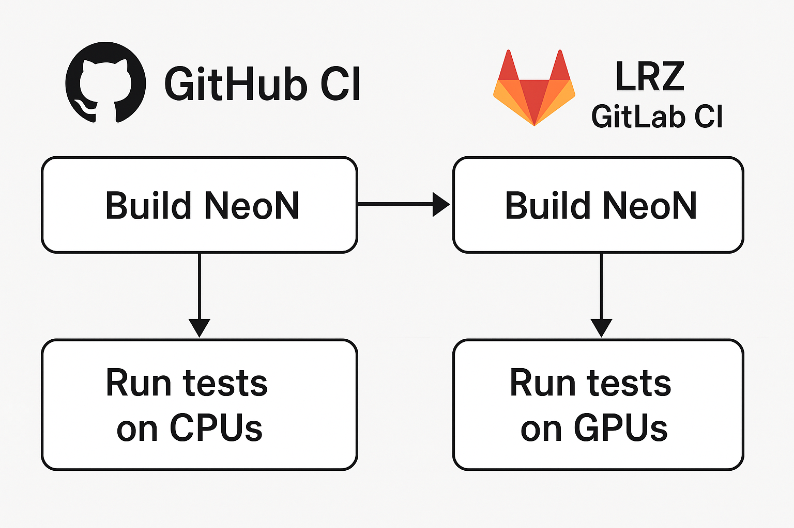

Continuous Integration
========
The **NeoN** project uses a two-level Continuous Integration (CI) system
to ensure correct builds, GPU compatibility, and automated benchmarking.

The main repository is hosted on **GitHub**, and GPU-based workflows are delegated
to **LRZ GitLab**, where jobs are executed on both **NVIDIA** and **AMD** GPUs.
The CI architecture for NeoN is illustrated below.

-------------------------------
Continuous Integration on GitHub
-------------------------------
GitHub CI is responsible for managing the overall NeoN CI workflow.

**Responsibilities:**

* Build and test NeoN on **CPU** across different platforms (Linux, macOS, Windows).
* Push the source code and commit metadata to **LRZ GitLab**.
* Cancel outdated pipelines on LRZ GitLab for the same branch.
* Trigger new LRZ GitLab pipelines for GPU builds and benchmarks.

.. note::
   The GitHub CI acts as the *control layer* for all NeoN CI operations.
   Developers interact only with GitHub — all LRZ GitLab pipelines are triggered automatically.

-------------------------------
Continuous Integration on LRZ GitLab
-------------------------------
The LRZ GitLab CI handles GPU-related operations.

**Responsibilities:**

* Build and test NeoN on **NVIDIA** and **AMD** GPU on Linux.
* Run benchmark jobs after successful build and test stages.
* Report the status and results back to GitHub for unified monitoring.

.. _ci-neon-workflow:

-------------------------------
Development Workflow
-------------------------------
The development workflow for NeoN proceeds as follows:

#. A developer opens a pull request (PR) or pushes a commit to an existing PR on GitHub.
#. GitHub CI builds and tests NeoN on CPUs.
#. GitHub CI pushes the same branch to LRZ GitLab.
#. All pending or running LRZ GitLab pipelines for that branch are canceled.
#. GitHub CI triggers a **new LRZ GitLab pipeline**.
#. LRZ GitLab CI builds and tests NeoN on GPUs.
#. *(Optional)* Benchmark jobs are executed after successful testing.
#. The developer monitors all results directly on GitHub.

.. _ci-integration-tests:

-------------------------------
Integration Tests
-------------------------------
**NeoN** is a CFD library that can be integrated into other frameworks. An option is to use the
GitHub repository **FoamAdapter**, which provides an adapter to integrate NeoN with OpenFOAM.

To ensure the correctness of this integration, the CI system includes jobs that build and run
FoamAdapter with NeoN. The integration tests are executed on CPUs and GPUs.

The integration tests on CPUs are executed directly by GitHub CI.

The integration tests on GPUs are handled by GitHub CI, but executed on GPUs by LRZ GitLab.
The procedure is as follows:

#. GitHub CI triggers a pipeline on **NeoN LRZ GitLab** which builds and tests NeoN.
#. If the pipeline succeeds, GitHub CI triggers a new pipeline on **FoamAdapter LRZ GitLab**.
#. The FoamAdapter pipeline builds and tests FoamAdapter with the NeoN version triggering the pipeline.
#. *(Optional)* Benchmarking is triggered on LRZ GitLab after successful integration tests.

This ensures that any changes in NeoN do not break the integration with FoamAdapter.
The procedure is illustrated below.

**Branch Handling Rules:**
When triggering the FoamAdapter pipeline, the following rules apply to determine which FoamAdapter branch to use:

* If a branch with the same name as the NeoN branch exists on LRZ GitLab, it is used directly.
* Otherwise, the **main** branch is used as a fallback.

.. tip::
   Use the ``benchmark`` label on a NeoN pull request to trigger benchmarking jobs.

.. _ci-neon-labels:

-------------------------------
Pull Request Labels
-------------------------------
NeoN’s GitHub repository uses labels to control the CI behavior.

**Relevant Labels:**

* ``Skip-build`` — Skip all build-and-test jobs on both GitHub and LRZ GitLab.
* ``benchmark`` — Enable GPU benchmarking jobs after successful build-and-test jobs and integration tests.

These labels allow developers to customize the CI process according to their needs.

.. _ci-neon-summary:

-------------------------------
Summary
-------------------------------
The NeoN CI system provides:

* Unified GitHub-driven CI management.
* Transparent CPU and GPU build workflows.
* Automatic synchronization between GitHub and LRZ GitLab.
* Branch-aware pipeline handling and cancellation.
* On-demand GPU benchmarking via PR labels.

.. seealso::

   * :ref:`ci-neon-workflow`
   * :ref:`ci-integration-tests`
   * :ref:`ci-neon-labels`
