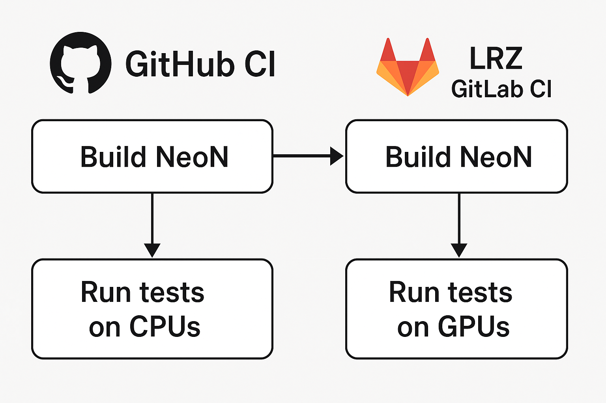

Continuous Integration
========
The **NeoN** project uses a two-level Continuous Integration (CI) system
to ensure correct builds, GPU compatibility, and automated benchmarking.

The main repository is hosted on **GitHub**, and GPU-based workflows are delegated
to **LRZ GitLab**, where jobs are executed on both **NVIDIA** and **AMD** GPUs.
The CI architecture for NeoN is illustrated below.

-------------------------------
Continuous Integration on GitHub
-------------------------------
GitHub CI is responsible for managing the overall NeoN CI workflow.

**Responsibilities:**

* Build and test NeoN on **CPU** across different platforms (Linux, macOS, Windows).
* Push the source code and commit metadata to **LRZ GitLab**.
* Cancel outdated pipelines on LRZ GitLab for the same branch.
* Trigger new LRZ GitLab pipelines for GPU builds and benchmarks.

.. note::
   The GitHub CI acts as the *control layer* for all NeoN CI operations.
   Developers interact only with GitHub — all LRZ GitLab pipelines are triggered automatically.

--------------------
Python Wheel CI/CD
--------------------
In addition to the build-and-test workflows, NeoN provides a dedicated GitHub Actions workflow for
building and distributing Python wheels. This workflow is defined in
``.github/workflows/python_wheels.yaml`` and is responsible for release packaging rather than for
ordinary pull-request testing.

Release builds are managed by GitHub Actions and ``cibuildwheel``. The workflow creates Python
wheels inside controlled CI environments and uploads or publishes the resulting artifacts.

The workflow supports both stable and development versions. For a tag such as ``v0.1.2``, the
package version is derived from the tag and treated as a stable release. For manually triggered
builds, the workflow generates a development version with a ``.dev`` suffix so that test artifacts
do not conflict with stable releases.

CPU wheels are built for Linux x86-64, Linux ARM64, Windows AMD64, macOS Apple Silicon, and macOS
Intel. The matrix covers CPython 3.9 through 3.13. MPI and optional dependencies such as PETSc,
ADIOS2, and SUNDIALS are disabled for these wheels, and CUDA/HIP support is disabled. This keeps the
default PyPI package installable without requiring those external HPC libraries.

After each CPU wheel is built and repaired, ``cibuildwheel`` installs it into an isolated test
environment. The current installed-wheel check verifies that the package imports, its distribution
and module versions agree, its backend feature indicators are valid, and serial execution support is
present. The complete Python binding test suite is not currently executed against every repaired
wheel.

CUDA wheels are handled separately. The Linux wheel job installs the CUDA toolkit inside the
``manylinux`` container before running ``cibuildwheel``. CUDA wheels are built with Kokkos CUDA
support enabled and receive a local version suffix such as ``+cuda128``. The NVIDIA driver library
``libcuda.so.1`` is explicitly excluded from wheel repair, because it is provided by the user's
installed NVIDIA driver and must not be bundled into the wheel.

.. note::
   GitHub-hosted runners provide CPU machines only. They can compile CUDA wheels if the CUDA toolkit
   is installed in the build container, but they cannot run or import the CUDA extension as a full
   runtime test because no NVIDIA driver or GPU is available. CUDA wheels must therefore be validated
   on a machine with a compatible NVIDIA driver and GPU.

Publishing is separated by wheel type:

* **CPU wheels** are published to PyPI through PyPI Trusted Publishing. This uses GitHub's OpenID
  Connect identity instead of storing a long-lived PyPI API token.
* **CUDA wheels** are uploaded as GitHub Actions artifacts and can be attached to GitHub Releases.
  This keeps GPU-specific, large, driver-dependent wheels separate from the default PyPI package.

To rehearse the publish flow before a real release, dispatch the workflow manually with
``build_wheels``, ``build_cpu`` and ``publish_repository=testpypi``. This builds a unique ``.dev``
version and uploads it to TestPyPI, so Trusted Publishing configuration and package metadata can be
validated without touching the production index. TestPyPI needs its own trusted-publisher entry and a
GitHub ``testpypi`` environment; ``publish_repository=pypi`` targets the production index instead.

The workflow also includes recovery paths for already-built artifacts. If a build succeeds but a
publish or release-upload step fails, existing wheel artifacts can be reused by providing the
original GitHub Actions run ID. This avoids rebuilding expensive CPU or CUDA wheels only to repeat an
upload step.

At the time of writing, the CUDA wheel path is intentionally narrow while it is being validated: it
builds the CUDA 12.8 variant for CPython 3.12 on Linux x86-64. Runtime wheel testing is skipped in
that build job because the GitHub-hosted runner has no GPU. The same structure can be extended to
additional Python versions, CUDA versions, and GPU architectures after the packaged wheel is
validated on production hardware.

-------------------------------
Conda package CI/CD
-------------------------------
``.github/workflows/conda_packages.yaml`` builds the ``neon-pde`` conda package with
``rattler-build`` and publishes it to a `prefix.dev <https://prefix.dev>`_ channel, so that NeoN can
be consumed from a `pixi <https://pixi.sh>`_ environment. It runs on the same triggers as the wheel
workflow (``v*.*.*`` tags and manual dispatch) and resolves its version with the same
``scripts/set_package_version.py`` logic, so a wheel and a conda package built from one commit report
the same ``neon.__version__``.

The recipe lives in ``recipe/recipe.yaml``. ``ci/build_conda_packages.sh`` is the single entry point
used by both CI and local builds: it exports ``NEON_VERSION``, writes the per-build variant
configuration (python version, GPU flavour, C runtime floor) and calls ``rattler-build``.
``ci/install_rattler_build.sh`` installs a pinned, checksum-verified rattler-build release.

CPU packages are built for CPython 3.10-3.13 on ``linux-64``, ``linux-aarch64``, ``osx-64`` and
``osx-arm64``. There is no ``win-64`` conda package, because NeoN disables Ginkgo on Windows and the
wheel is the supported Windows path. Python 3.9 is also wheel-only: conda-forge builds ``nanobind``,
which the ``nanobind.stubgen`` POST_BUILD step needs, only for Python 3.10 and newer. The GPU flavour is encoded in the build string
(``cpu_py312_*``, ``cuda_py312_*``, ``rocm_py312_*``) so all flavours can coexist in one channel.

Unlike the wheels, the conda package is installed by CMake rather than by ``pip``: the C++ runtime
and its bundled Kokkos, Ginkgo, Umpire and cpptrace libraries go to ``$PREFIX/lib``, headers and
CMake package files to ``$PREFIX/include`` and ``$PREFIX/lib/cmake/NeoN``, and only the python
package is moved into ``site-packages``. Relocation is handled by rattler-build's rpath rewrite
instead of by ``auditwheel``/``delocate``.

.. note::

   The build clones Kokkos, Ginkgo and Umpire from GitHub through CPM, so it needs network access
   during the build. That is acceptable for our own channel but would not pass conda-forge's offline
   build policy.

Publishing requires two repository settings: a ``PREFIX_DEV_CHANNEL`` variable naming the target
channel and a ``PREFIX_DEV_API_KEY`` secret holding an API key with write access to it. The publish
job runs in the ``prefix-dev`` GitHub environment and uploads with ``--skip-existing``, so re-running
it after a partial failure does not fail on packages that already landed.

The CUDA package mirrors the CUDA wheel: CUDA 12.8, CPython 3.12, Linux x86-64, NVIDIA Ampere
(``sm_80``). It depends on the ``__cuda`` virtual package so it cannot resolve on a machine without a
suitable driver, and like the CUDA wheel it is not runtime-tested in CI. The ROCm package is
manual-dispatch only and experimental: conda-forge ships ``hip-devel`` and ``hipcc`` but none of the
ROCm math libraries (rocBLAS, rocSPARSE, rocThrust, rocPRIM) that Ginkgo's HIP backend needs, so that
flavour is Kokkos HIP without a Ginkgo solver backend.

-------------------------------
Continuous Integration on LRZ GitLab
-------------------------------
The LRZ GitLab CI handles GPU-related operations.

**Responsibilities:**

* Build and test NeoN on **NVIDIA** and **AMD** GPU on Linux.
* Run benchmark jobs after successful build and test stages.
* Report the status and results back to GitHub for unified monitoring.

.. _ci-neon-workflow:

-------------------------------
Development Workflow
-------------------------------
The development workflow for NeoN proceeds as follows:

#. A developer opens a pull request (PR) or pushes a commit to an existing PR on GitHub.
#. GitHub CI builds and tests NeoN on CPUs, and pushes the same branch to LRZ GitLab.
#. GitHub CI cancels all pending or running LRZ GitLab pipelines for that branch.
#. GitHub CI triggers a **new LRZ GitLab pipeline**.
#. LRZ GitLab CI builds and tests NeoN on GPUs.
#. If the tests pass, GitHub CI triggers integration tests with the **NeoFOAM** on GPUs (see below).
#. *(Optional)* Benchmark jobs are executed after successful testing, including integration testing.
#. The developer monitors all results directly on GitHub.

.. tip::
   Use the ``benchmark`` label on a NeoN pull request to trigger benchmarking jobs.

.. _ci-integration-tests:

-------------------------------
Integration Tests
-------------------------------
**NeoN** is a CFD library that can be integrated into other frameworks. An option is to use the
GitHub repository **NeoFOAM**, which provides an adapter to integrate NeoN with OpenFOAM.

To ensure the correctness of this integration, the CI system includes jobs that build and run
NeoFOAM with NeoN. The integration tests are executed on CPUs by GitHub CI, while the integration
tests on GPUs are executed by LRZ GitLab CI as illustrated below.

.. mermaid::

   flowchart TD
       A[GitHub CI] --> B[NeoN LRZ GitLab Pipeline]
       B -->|Build & Test NeoN| C{Pipeline Success?}
       C -->|Yes| D[NeoFOAM LRZ GitLab Pipeline]
       D -->|Build & Test NeoFOAM using same NeoN version| E[End]
       C -->|No| F[Stop]

#. GitHub CI triggers a pipeline on **NeoN LRZ GitLab** which builds and tests NeoN.
#. If the pipeline succeeds, GitHub CI triggers a pipeline on **NeoFOAM LRZ GitLab**.
#. The NeoFOAM pipeline builds and tests NeoFOAM with the NeoN version triggering the pipeline.

This ensures that any changes in NeoN do not break the integration with NeoFOAM.

**Branch Handling Rules:**
When triggering the NeoFOAM pipeline, the following rules apply to determine which NeoFOAM branch to use:

* If a branch with the same name as the NeoN branch exists on LRZ GitLab, it is used directly.
* Otherwise, the **main** branch is used as a fallback.

.. _ci-neon-labels:

-------------------------------
Pull Request Labels
-------------------------------
NeoN’s GitHub repository uses labels to control the CI behavior.

**Relevant Labels:**

* ``skip-build`` — Skip all build-and-test jobs on both GitHub and LRZ GitLab.
* ``benchmark`` — Enable GPU benchmarking jobs after successful build-and-test jobs and integration tests.

These labels allow developers to customize the CI process according to their needs.

.. _ci-neon-summary:

-------------------------------
Summary
-------------------------------
The NeoN CI system provides:

* Unified GitHub-driven CI management.
* Transparent CPU and GPU build workflows.
* Automatic synchronization between GitHub and LRZ GitLab.
* Branch-aware pipeline handling and cancellation.
* On-demand GPU benchmarking via PR labels.

.. seealso::

   * :ref:`ci-neon-workflow`
   * :ref:`ci-integration-tests`
   * :ref:`ci-neon-labels`
