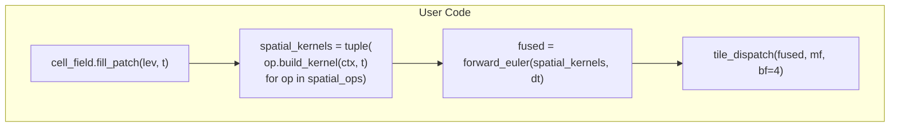
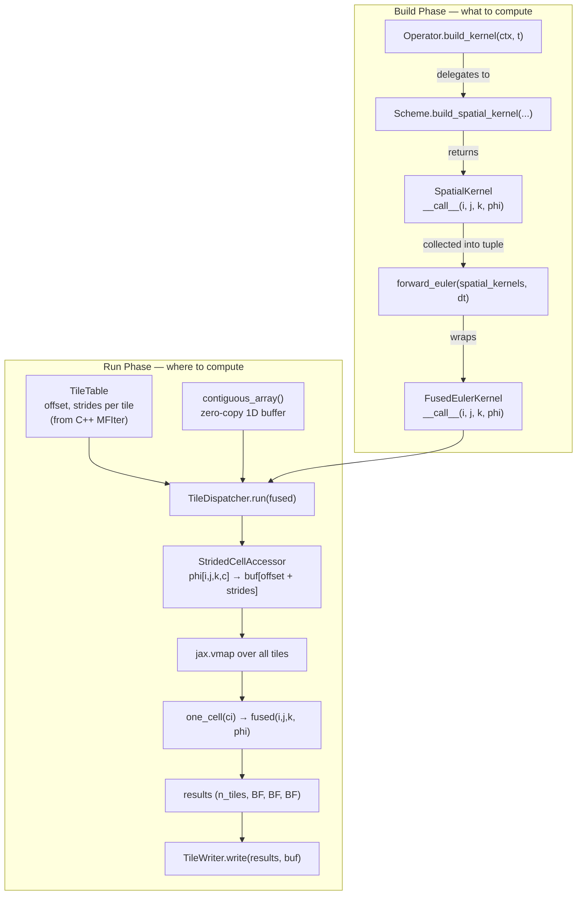
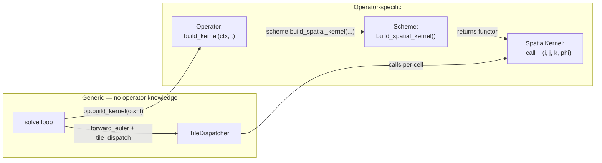
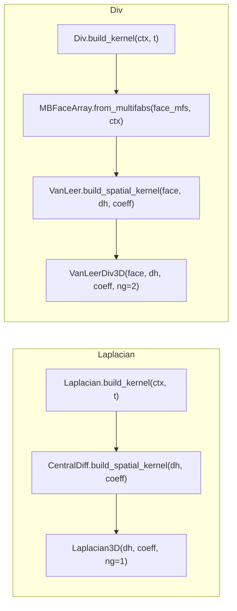
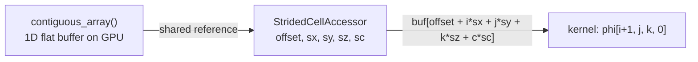
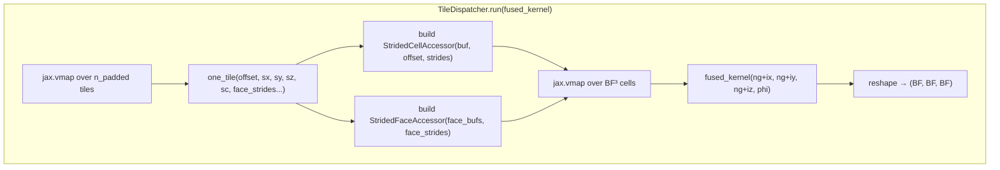
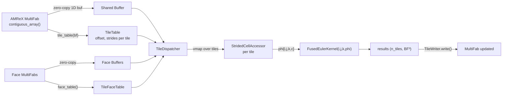
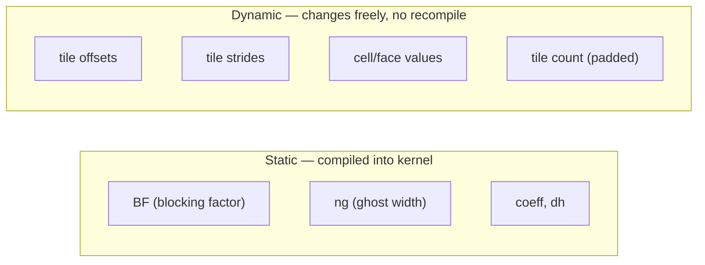

# Tile Dispatch: Zero-Copy Uniform Kernels via Blocking Factor Tiles

## Forward Euler — User View

The user writes a 5-line solve loop. Everything else is handled by the framework.

```python
for lev in range(n_levels):
    cell_field.fill_patch(lev, t)
    spatial_kernels = tuple(op.build_kernel(ctx, t) for op in expr.spatial_ops)
    fused = forward_euler(spatial_kernels, dt / ddt_coeff)
    tile_dispatch(fused, cell_field.mf[lev], bf=4)
```



No type checks, no bucketing, no shape knowledge. The user only sees operators and `forward_euler`.

---

## Design Overview



**Key separation**: the build phase produces a pure kernel (no data, no shapes).
The run phase provides data via strided accessors into the shared buffer.
The kernel never knows about tiles, boxes, or AMR — it just sees `phi[i, j, k, c]`.

---

## Problem

AMR boxes have varying sizes → multiple compiled kernels or wasted padding.
Both bucketed dispatch and uniform-buffer dispatch have tradeoffs
(many compilations vs wasted compute/memory).

## Core Idea

Every AMR box is a multiple of the blocking factor (e.g. 4 or 8).
Tile each box into `BF×BF×BF` chunks. Build a flat table of
`(offset, strides)` into the **existing** MultiFab contiguous array.
Each tile is exactly the same shape. One kernel, one compilation,
zero copy, zero padding waste.

```
MultiFab contiguous memory (Fortran order):
[===box0(16×8×12)===|===box1(8×16×8)===|===box2(12×12×16)===]

BF = 4 → tile each box into 4×4×4 chunks:
  box0: (16/4)×(8/4)×(12/4) = 4×2×3 = 24 tiles
  box1: (8/4)×(16/4)×(8/4)  = 2×4×2 = 16 tiles
  box2: (12/4)×(12/4)×(16/4) = 3×3×4 = 36 tiles
                                total = 76 tiles

Tile table: 76 entries, each pointing into the contiguous array.
One kernel compiled for (BF, BF, BF). vmap over 76 tiles.
```

---

## Layer Responsibilities



| Layer | Generic? | What it does |
|-------|----------|-------------|
| **Solve loop** | Yes | `fill_patch`, collects `build_kernel` results, calls `forward_euler` + `tile_dispatch` |
| **Operator** | No | Builds own extra data from ctx (face arrays, gamma), delegates to scheme |
| **Scheme** | No | Constructs spatial kernel with stencil pattern + coefficients |
| **SpatialKernel** | No | `__call__(i, j, k, phi)` — pure stencil computation |
| **TileDispatcher** | Yes | Builds strided accessors, vmaps over tiles, calls kernel per cell |

---

## Build Phase: Operators and Schemes

Operators are **stateless** — `build_kernel(ctx, t)` is pure. Each operator
delegates to its scheme, which returns a spatial kernel (equinox module).



### Operator Code

```python
class Laplacian:
    def build_kernel(self, ctx, t):
        return self.scheme.build_spatial_kernel(
            dh=ctx.dh, coeff=self.coeff * self.gamma)

class Div:
    def build_kernel(self, ctx, t):
        face = MBFaceArray.from_multifabs(
            (self.face_mfs[0], self.face_mfs[1], self.face_mfs[2]), ctx)
        return self.scheme.build_spatial_kernel(
            face=face, dh=ctx.dh, coeff=self.coeff)
```

### Scheme Code

```python
class CentralDiffLaplacian:
    def build_spatial_kernel(self, dh, coeff):
        return Laplacian3D(dh=dh, coeff=coeff)

class VanLeer:
    def build_spatial_kernel(self, face, dh, coeff):
        return VanLeerDiv3D(face=face, dh=dh, coeff=coeff)
```

---

## Build Phase: Forward Euler

Wraps spatial kernels into a single fused kernel for time integration.
`phi` is a **parameter to `__call__`**, not a field — the kernel is a pure
function of `(i, j, k, phi)`.

```python
def forward_euler(spatial_kernels, dt_over_coeff):
    return FusedEulerKernel(spatial_kernels=spatial_kernels,
                            dt_over_coeff=dt_over_coeff)

class FusedEulerKernel(eqx.Module):
    spatial_kernels: tuple
    dt_over_coeff: float = eqx.field(static=True)
    ng: int = eqx.field(static=True)

    def __init__(self, spatial_kernels, dt_over_coeff):
        self.spatial_kernels = spatial_kernels
        self.dt_over_coeff = dt_over_coeff
        self.ng = max(s.ng for s in spatial_kernels)

    def __call__(self, i, j, k, phi):
        total = sum(s(i, j, k, phi) for s in self.spatial_kernels)
        return phi[i, j, k, 0] - self.dt_over_coeff * total
```

---

## Spatial Kernels

Kernel bodies are **identical** to the current code. The only change:
`phi` is passed as argument to `__call__`, not stored on the kernel.
`phi` implements `__getitem__(i, j, k, c)` — could be `CellArray`,
`StridedCellAccessor`, or any object with that interface.

### Laplacian3D

```python
class Laplacian3D(eqx.Module):
    """Central difference: coeff * sum_ax (phi[+1] - 2*phi + phi[-1]) / dx^2."""

    dh: jnp.ndarray            # (3,)
    coeff: float = eqx.field(static=True)
    ng: int = eqx.field(static=True, default=1)

    def __call__(self, i, j, k, phi):
        c = phi[i, j, k, 0]
        total = 0.0
        for ax in Axis:
            d = ax.d
            total += (phi[i+d[0], j+d[1], k+d[2], 0]
                      - 2 * c
                      + phi[i-d[0], j-d[1], k-d[2], 0]) / self.dh[ax]**2
        return self.coeff * total
```

### VanLeerDiv3D

```python
def _vanleer_corr(d_up, d_down):
    prod = d_up * d_down
    return jnp.where(prod > 0.0, 2.0 * prod / (d_up + d_down), 0.0)


class VanLeerDiv3D(eqx.Module):
    """TVD VanLeer divergence with slope limiting."""

    face: StridedFaceAccessor
    dh: jnp.ndarray
    coeff: float = eqx.field(static=True)
    ng: int = eqx.field(static=True, default=2)

    def __call__(self, i, j, k, phi):
        total = 0.0
        for ax in Axis:
            d = ax.d
            fl = self.face[ax][i, j, k]
            fr = self.face[ax][i+d[0], j+d[1], k+d[2]]

            s = [phi[i+n*d[0], j+n*d[1], k+n*d[2], 0]
                 for n in range(-2, 3)]

            d_down_l = s[2] - s[1]
            corr_l = jnp.where(
                fl >= 0,
                _vanleer_corr(s[1] - s[0], d_down_l),
                _vanleer_corr(s[3] - s[2], d_down_l))
            phi_l = jnp.where(fl >= 0,
                              s[1] + 0.5 * corr_l,
                              s[2] - 0.5 * corr_l)

            d_down_r = s[3] - s[2]
            corr_r = jnp.where(
                fr >= 0,
                _vanleer_corr(s[2] - s[1], d_down_r),
                _vanleer_corr(s[4] - s[3], d_down_r))
            phi_r = jnp.where(fr >= 0,
                              s[2] + 0.5 * corr_r,
                              s[3] - 0.5 * corr_r)

            total += (fr * phi_r - fl * phi_l) / self.dh[ax]
        return self.coeff * total
```

---

## Run Phase: Strided Accessors

Drop-in replacements for `CellArray` and `FaceArray`. They index directly
into the shared contiguous buffer via `offset + strides` — no data copied per tile.



```python
class StridedCellAccessor(eqx.Module):
    """Cell data via offset + strides into shared contiguous buffer."""
    buf: jnp.ndarray       # full 1D contiguous MultiFab buffer (shared)
    offset: jnp.int32      # start of this tile's corner in buf
    sx: jnp.int32           # stride x = 1 (Fortran x-fastest)
    sy: jnp.int32           # stride y = Nx of parent box
    sz: jnp.int32           # stride z = Nx * Ny
    sc: jnp.int32           # stride comp = Nx * Ny * Nz

    def __getitem__(self, idx):
        i, j, k, c = idx
        return self.buf[self.offset + i * self.sx + j * self.sy
                        + k * self.sz + c * self.sc]


class StridedFaceSlice(eqx.Module):
    """Single-direction face data via offset + strides."""
    buf: jnp.ndarray
    offset: jnp.int32
    sx: jnp.int32
    sy: jnp.int32
    sz: jnp.int32

    def __getitem__(self, idx):
        i, j, k = idx
        return self.buf[self.offset + i * self.sx + j * self.sy + k * self.sz]


class StridedFaceAccessor(eqx.Module):
    """Staggered face data for all 3 directions via strided access."""
    fx: StridedFaceSlice
    fy: StridedFaceSlice
    fz: StridedFaceSlice

    def __getitem__(self, ax):
        return (self.fx, self.fy, self.fz)[int(ax)]
```

---

## Run Phase: Tile Table

Built from `mf.tile_table(bf)` on the C++ side — iterates `MFIter`,
computes per-tile Fortran-order offsets and strides.
Pure metadata, no data copies. Called once after regridding.

### How Tile Indices Are Computed

The C++ binding (`MultiFab.tile_table(bf)`) builds the tile table in two passes
over the `MFIter`:

**Pass 1 — count tiles:**

```
for each box via MFIter:
    (Nx, Ny, Nz) = grown box dimensions (valid + 2*ng per axis)
    (vNx, vNy, vNz) = valid dimensions = (Nx-2*ng, Ny-2*ng, Nz-2*ng)
    n_tiles += (vNx/bf) * (vNy/bf) * (vNz/bf)
```

**Pass 2 — fill tile descriptors:**

```
box_offset = 0        ← running offset into contiguous buffer
for each box via MFIter:
    (Nx, Ny, Nz) = grown box dimensions
    strides: sx = 1,  sy = Nx,  sz = Nx*Ny,  sc = Nx*Ny*Nz   (Fortran order)

    for ti in 0 .. vNx/bf:
      for tj in 0 .. vNy/bf:
        for tk in 0 .. vNz/bf:
          (ci, cj, ck) = (ti*bf, tj*bf, tk*bf)
          tile_offset = box_offset + ci*sx + cj*sy + ck*sz

    box_offset += Nx * Ny * Nz * nc
```

The tile offset points to the corner of the tile region within the grown box.
Because the tile corner starts at `(ti*bf, tj*bf, tk*bf)` — i.e. at the start
of the grown box, not the valid box — the kernel adds `ng` internally when
iterating valid cells (`kernel(ng+ix, ng+iy, ng+iz, phi)`), and ghost reads
at `(ng+ix-1, ...)` naturally reach into the preceding tile or the boundary
ghost layer.

**Worked example:**

```
Box 0: valid = 16×8×12, ng = 1 → grown = 18×10×14
  Fortran strides: sx=1, sy=18, sz=180, sc=2520
  Valid tiles: (16/4)×(8/4)×(12/4) = 4×2×3 = 24 tiles

  Tile (ti=0, tj=0, tk=0): offset = box_offset + 0
  Tile (ti=1, tj=0, tk=0): offset = box_offset + 4*1  = box_offset + 4
  Tile (ti=0, tj=1, tk=0): offset = box_offset + 4*18 = box_offset + 72
  Tile (ti=0, tj=0, tk=1): offset = box_offset + 4*180 = box_offset + 720

Box 1: valid = 8×16×8, ng = 1 → grown = 10×18×10
  Fortran strides: sx=1, sy=10, sz=180, sc=1800
  box_offset = 18*10*14*nc (= after box 0)
  Valid tiles: (8/4)×(16/4)×(8/4) = 2×4×2 = 16 tiles
  ...
```

Note: strides differ per box because strides are the parent box's grown
dimensions. This is why each tile entry carries its own strides.

**Padding to power-of-2:**

After filling all real tiles, the arrays are padded to the next power-of-2
by replicating tile 0. This ensures `jax.vmap` over `n_padded` tiles
never triggers recompilation when the tile count changes (e.g. after regrid).
Only the first `n_tiles` results are written back.

```
76 real tiles → n_padded = 128
Entries 76..127 are copies of tile 0 (results discarded by TileWriter).
```

### Prerequisite: Single-Chunk Allocation

`contiguous_array()` requires the MultiFab to be allocated with
`MFInfo().SetAllocSingleChunk(true)`. This places all FABs in a single
contiguous allocation so that tile offsets can index into one flat buffer.

### Data Structures

```python
class TileTable(eqx.Module):
    """Per-tile addressing into contiguous MultiFab buffer."""
    offset: jnp.ndarray     # (n_padded,) start index
    stride_x: jnp.ndarray   # (n_padded,) = 1
    stride_y: jnp.ndarray   # (n_padded,) = Nx of parent box
    stride_z: jnp.ndarray   # (n_padded,) = Nx * Ny
    stride_c: jnp.ndarray   # (n_padded,) = Nx * Ny * Nz

    box_id: jnp.ndarray     # (n_padded,) which box
    tile_i: jnp.ndarray     # (n_padded,) tile index within box
    tile_j: jnp.ndarray
    tile_k: jnp.ndarray

    n_tiles: int = eqx.field(static=True)
    n_padded: int = eqx.field(static=True)
    bf: int = eqx.field(static=True)
    ng: int = eqx.field(static=True)


class TileFaceTable(eqx.Module):
    """Per-tile addressing into the 3 contiguous face buffers."""
    fx_offset: jnp.ndarray;  fx_sx: jnp.ndarray;  fx_sy: jnp.ndarray;  fx_sz: jnp.ndarray
    fy_offset: jnp.ndarray;  fy_sx: jnp.ndarray;  fy_sy: jnp.ndarray;  fy_sz: jnp.ndarray
    fz_offset: jnp.ndarray;  fz_sx: jnp.ndarray;  fz_sy: jnp.ndarray;  fz_sz: jnp.ndarray
```

### Python API

```python
from neon.blockamr.tile_table import tile_table_from_multifab

tt = tile_table_from_multifab(mf, bf=4)   # calls mf.tile_table(bf) → TileTable
buf = mf.contiguous_array()               # zero-copy 1D JAX array
```

---

## Run Phase: TileDispatcher



```python
class TileDispatcher(eqx.Module):
    """Vmaps a fused kernel over all tiles on a level."""
    buf: jnp.ndarray
    face_bufs: tuple
    tile_table: TileTable
    face_table: TileFaceTable
    bf: int = eqx.field(static=True)
    ng: int = eqx.field(static=True)

    def _cell_accessor(self, offset, sx, sy, sz, sc):
        return StridedCellAccessor(
            buf=self.buf, offset=offset, sx=sx, sy=sy, sz=sz, sc=sc)

    def _face_accessor(self, fx_off, fx_sx, fx_sy, fx_sz,
                             fy_off, fy_sx, fy_sy, fy_sz,
                             fz_off, fz_sx, fz_sy, fz_sz):
        return StridedFaceAccessor(
            fx=StridedFaceSlice(buf=self.face_bufs[0],
                                offset=fx_off, sx=fx_sx, sy=fx_sy, sz=fx_sz),
            fy=StridedFaceSlice(buf=self.face_bufs[1],
                                offset=fy_off, sx=fy_sx, sy=fy_sy, sz=fy_sz),
            fz=StridedFaceSlice(buf=self.face_bufs[2],
                                offset=fz_off, sx=fz_sx, sy=fz_sy, sz=fz_sz))

    def run(self, fused_kernel):
        """Returns (n_padded, BF, BF, BF)."""
        tt = self.tile_table
        ft = self.face_table
        bf, ng = self.bf, self.ng

        def one_tile(offset, sx, sy, sz, sc,
                     fx_off, fx_sx, fx_sy, fx_sz,
                     fy_off, fy_sx, fy_sy, fy_sz,
                     fz_off, fz_sx, fz_sy, fz_sz):
            phi = self._cell_accessor(offset, sx, sy, sz, sc)

            def one_cell(ci):
                iz = ci % bf
                iy = (ci // bf) % bf
                ix = ci // (bf * bf)
                return fused_kernel(ng + ix, ng + iy, ng + iz, phi)

            return jax.vmap(one_cell)(jnp.arange(bf**3)).reshape(bf, bf, bf)

        return jax.vmap(one_tile)(
            tt.offset, tt.stride_x, tt.stride_y, tt.stride_z, tt.stride_c,
            ft.fx_offset, ft.fx_sx, ft.fx_sy, ft.fx_sz,
            ft.fy_offset, ft.fy_sx, ft.fy_sy, ft.fy_sz,
            ft.fz_offset, ft.fz_sx, ft.fz_sy, ft.fz_sz)
```

---

## Run Phase: Writing Results Back

```python
class TileWriter(eqx.Module):
    """Vectorised scatter of tile results back into contiguous buffer."""
    tile_table: TileTable
    bf: int = eqx.field(static=True)

    def write(self, results, buf):
        tt = self.tile_table
        bf, n = self.bf, tt.n_tiles
        ii = jnp.arange(bf)
        idx = (tt.offset[:n, None, None, None]
               + ii[None, :, None, None] * tt.stride_x[:n, None, None, None]
               + ii[None, None, :, None] * tt.stride_y[:n, None, None, None]
               + ii[None, None, None, :] * tt.stride_z[:n, None, None, None])
        return buf.at[idx.ravel()].set(results[:n].ravel())
```

---

## Full Solve Example

```python
def solve_tiled(cell_field, face_field, expr, dt, ddt_coeff, dh, bf=4):
    for lev in range(cell_field.n_levels):
        cell_field.fill_patch(lev, t)
        mf = cell_field.mf[lev]
        ctx = BoxContext.from_multifab(mf, dh=dh)

        # Build: what to compute (pure, no array data)
        spatial_kernels = tuple(
            op.build_kernel(ctx, t) for op in expr.spatial_ops)
        fused = forward_euler(spatial_kernels, dt / ddt_coeff)

        # Run: where to compute (tile dispatch)
        tt = tile_table_from_multifab(mf, bf=bf)
        ft = face_table_from_multifabs(
            [face_field[d].mf[lev] for d in range(3)], tt)

        dispatcher = TileDispatcher(
            buf=mf.contiguous_array(),
            face_bufs=tuple(face_field[d].mf[lev].contiguous_array()
                            for d in range(3)),
            tile_table=tt, face_table=ft, bf=bf, ng=mf.n_grow())

        results = dispatcher.run(fused)
        TileWriter(tt, bf).write(results, mf.contiguous_array())
```

---

## Ghost Cells Across Tiles

Tiles within the same box share ghost cells naturally — the strides
point into the same contiguous buffer, so `phi[i-1, j, k, 0]` on
a tile boundary reads from the neighbouring tile's valid region.

Tiles at box boundaries read AMReX-filled ghost cells (from `fill_patch`),
which are already in the contiguous buffer.

```
Box with ng=1, BF=4, valid=8:
ghosted layout: [g|0 1 2 3|4 5 6 7|g]
                     tile0     tile1

tile0 reads: [g 0 1 2 3 4] — the "4" is tile1's valid cell
tile1 reads: [3 4 5 6 7 g] — the "3" is tile0's valid cell
Both read from the same contiguous buffer. No duplication.
```

---

## Data Flow



---

## Compilation Behaviour

| Event | Recompiles? |
|-------|-------------|
| New timestep | No |
| AMR regrid (any box sizes) | No |
| Different number of boxes | No |
| Different number of tiles | No (padded to power-of-2) |
| Different blocking factor | Yes (BF is static) |
| Different ghost width | Yes (ng is static) |

**One compilation per (BF, ng) pair. Typically one compilation total.**

### Static vs Dynamic



---

## Comparison

|  | Bucketed | Uniform Buffer | Tile Dispatch |
|--|----------|---------------|---------------|
| Compilations | Per unique shape | Per level | **One total** |
| Wasted compute | None | Padding cells | **None** |
| Memory copy | Copy to buckets | Copy + pad | **Zero (gather via offsets)** |
| vmap batch size | Small | Full level | **All tiles on level** |
| GPU occupancy | Poor | Good | **Best (many small tiles)** |
| Complexity | Moderate | Simple | Moderate |

## Limitations

- Ghost width `ng` must be < `BF`, otherwise tile ghost region
  spans more than one neighbour tile (solvable with larger BF)
- Gather from contiguous buffer via indexing may be slower than
  contiguous reads for very large tiles (but BF=4 or 8 fits in cache)
- Face data strides are slightly more complex (staggered shapes)
