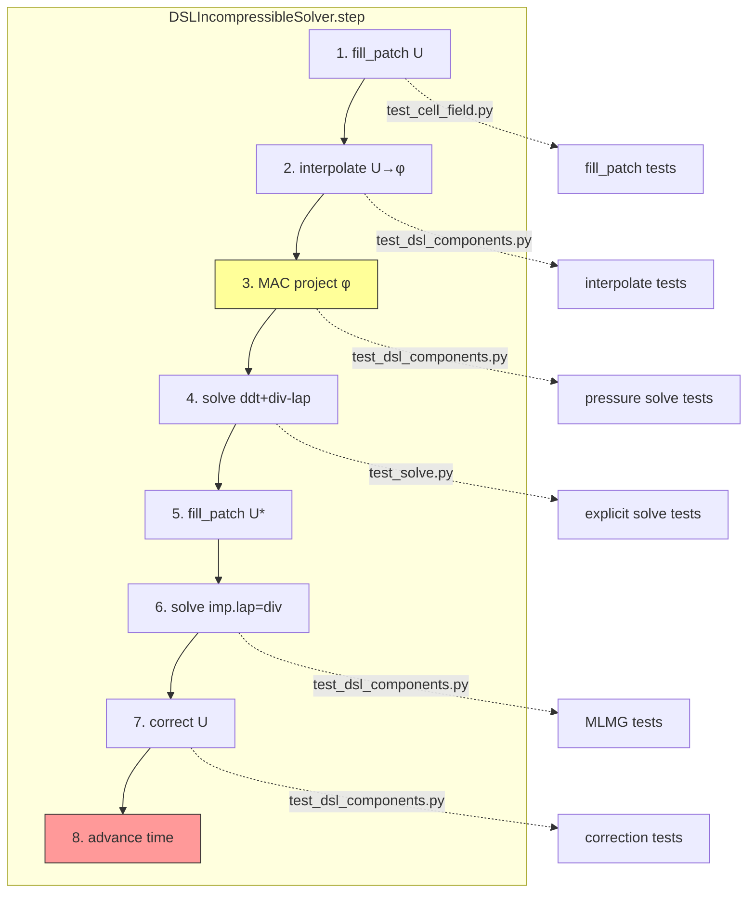
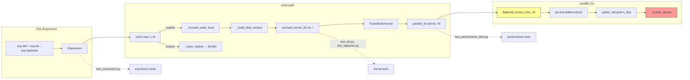
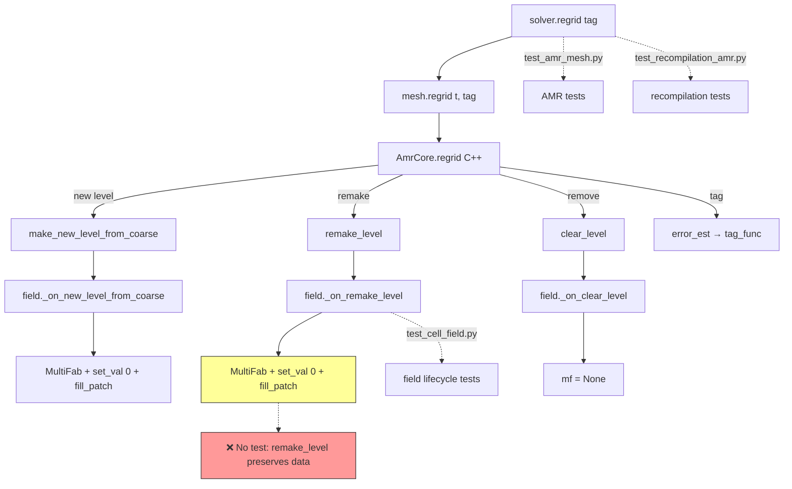

# Solver Validation Chain — Tests & Gaps

## Solver Step Chain



## Dispatch Chain



## AMR Regrid Chain



## Test Coverage Map

| Component | Test file | What's tested | Status |
|-----------|----------|---------------|--------|
| **Expression assembly** | test_expression.py | ddt+div+lap composition, scalar mul, negation | ✅ |
| **Explicit solve** | test_solve.py | Single-level constant advection, multi-level average_down | ✅ |
| **Implicit solve** | test_dsl_components.py | Pressure Poisson, divergence-free correction | ✅ |
| **Interpolate** | test_dsl_components.py | Linear field exact, cell→face | ✅ |
| **Correct** | test_dsl_components.py | U correction divergence-free | ✅ |
| **Laplacian kernel** | test_laplacian.py | Convergence (const + variable gamma) | ✅ |
| **Div kernels** | test_div.py | 4 schemes × convergence + multi-box | ✅ |
| **Grad kernel** | test_grad.py | Convergence | ✅ |
| **Fill patch** | test_fillpatch.py | Single-level, two-level conservative | ✅ |
| **Cell field lifecycle** | test_cell_field.py | Allocate, clear, AMR mesh | ✅ |
| **Face field lifecycle** | test_face_field.py | Allocate, shape, AMR | ✅ |
| **AMR mesh** | test_amr_mesh.py | Init, regrid, field allocation on fine | ✅ |
| **AMR core** | test_amrcore.py | Virtual dispatch, tagging | ✅ |
| **Boundary conditions** | test_bc.py | Dirichlet, Neumann, mixed | ✅ |
| **Tiled dispatch perf** | test_performance_tiled.py | Laplacian <15x C++, div non-zero, solve <5x C++ | ✅ |
| **Recompilation** | test_recompilation_amr.py | Stable grid, same-tag regrid, tier crossing | ✅ |
| **Full solver (lid cavity)** | test_dsl_lid_cavity.py | Re=100 centreline vs Ghia | ✅ |
| **Full solver (shear layer)** | test_double_shear_layer.py | Velocity bounded, AMR runs | ✅ |

## Missing Tests (Gaps)

### Gap 1: `_on_remake_level` data preservation
**No test verifies** that field data survives regrid via `fill_patch` in
`_on_remake_level`. The bug found today (U→0 after regrid) was in this path.

**Needed test**: After regrid with same tagging, field values should be
preserved (not zeroed). Compare field data before and after regrid.

### Gap 2: Multi-level explicit solve correctness
**test_solve.py** only tests constant advection (trivial) and checks
`average_down` runs without error. No convergence test for multi-level
explicit solve.

**Needed test**: Advection of a smooth field on 2-level AMR grid —
verify convergence rate matches single-level.

### Gap 3: MAC projection on multi-level
**test_dsl_components.py** tests pressure solve on single level.
No test for the MAC projection step specifically on multi-level.

**Needed test**: After MAC project on 2-level grid, verify div(φ)≈0
on both levels.

### Gap 4: Face flux update after regrid
No test verifies that face fluxes are correctly recomputed after regrid.
`FaceField._on_remake_level` just calls `_on_new_level` (allocates new
zeros) — face data is lost.

**Needed test**: After regrid, verify face fluxes are recomputed
(not stale/zero) before the next solve step.

### Gap 5: VanLeer/QUICK with tiled dispatch
**test_performance_tiled.py** tests Upwind div. No test for VanLeer or
QUICK divergence schemes through the tiled Pallas path.

**Needed test**: `evaluate(exp.div(ff, phi, scheme=VanLeer()))` through
the tiled dispatch — verify non-zero, matches expected convergence.

### Gap 6: ncomp > 1 through tiled dispatch
The solver uses `ncomp=3` for velocity. The tiled dispatch + Pallas kernel
handles `ncomp=1`. No test verifies `ncomp=3` through the new path.

**Needed test**: `solve()` with `ncomp=3` (velocity field) through
tiled dispatch — verify all 3 components updated correctly.

### Gap 7: CFL-adaptive dt
`DSLIncompressibleSolver` has `cfl` parameter for adaptive dt. No dedicated
test verifies dt changes correctly based on max velocity.

### Gap 8: Solver with real BCs (non-periodic)
**test_dsl_lid_cavity.py** tests with wall BCs but is slow (~100s).
No fast test for non-periodic BCs through the explicit solve path.

## Scheme Coverage Matrix

Each scheme needs: C++ baseline, DSL correctness (single-level), DSL correctness
(AMR multi-level), DSL performance benchmark vs C++.

### Divergence schemes

| Scheme | C++ baseline | DSL kernel test | DSL solve test | AMR test | Perf benchmark |
|--------|-------------|-----------------|----------------|----------|----------------|
| Upwind | ❌ missing `euler_step_upwind_lap` | ✅ test_div.py | ✅ test_solve.py | ❌ | ✅ bench_advdiff |
| Linear | ✅ `euler_step_linear_lap` | ✅ test_div.py | ❌ | ❌ | ✅ bench_advdiff |
| VanLeer | ✅ `euler_step_vanleer_lap` | ✅ test_div.py | ❌ | ❌ | ✅ bench_advdiff |
| QUICK | ❌ missing `euler_step_quick_lap` | ✅ test_div.py | ❌ | ❌ | ❌ |

### Laplacian schemes

| Scheme | C++ baseline | DSL kernel test | DSL solve test | AMR test | Perf benchmark |
|--------|-------------|-----------------|----------------|----------|----------------|
| CentralDiff | ✅ `laplacian` | ✅ test_laplacian.py | ✅ test_solve.py | ❌ | ✅ bench_laplacian |

### Time integration schemes

| Scheme | C++ baseline | DSL test | Status |
|--------|-------------|----------|--------|
| ForwardEuler | ✅ `euler_step_*` | ✅ test_solve.py | Working |
| RungeKutta2 | ❌ | ❌ NotImplementedError | Not implemented |
| RungeKutta4 | ❌ | ❌ NotImplementedError | Not implemented |

### What's needed per scheme

Each div scheme gets its own test file `test_scheme_<name>.py`:

```python
# test/blockamr/test_scheme_upwind.py

def test_upwind_evaluate_vs_cpp(blockamr_session):
    """DSL evaluate(div(ff, phi, scheme=Upwind())) matches C++ at 64^3."""
    # Single level, sin3d field, uniform velocity
    # Compare result arrays element-wise

def test_upwind_solve_single_level(blockamr_session):
    """DSL solve with Upwind converges on single level."""
    # Advect smooth field, verify L2 norm decreases with refinement

def test_upwind_solve_amr(blockamr_session):
    """DSL solve with Upwind works correctly on 2-level AMR grid."""
    # Create AMR mesh, tag center, solve 10 steps
    # Verify: field bounded, fine level has data, no NaN

def test_upwind_benchmark_vs_cpp(blockamr_session):
    """DSL solve with Upwind is within 5x of C++ at 64^3."""
    # Time DSL solve vs C++ euler_step_upwind_lap
    # assert ratio < 5.0
```

### Missing C++ baselines to add

Need C++ fused kernels in `stencil_kernels.cpp` for:
1. `euler_step_upwind_lap` — upwind div + laplacian (ng=1)
2. `euler_step_quick_lap` — QUICK div + laplacian (ng=2)

These follow the same pattern as `euler_step_vanleer_lap` and
`euler_step_linear_lap`.

## Priority for new tests

| Priority | What | Risk | Effort |
|----------|------|------|--------|
| **P0** | `_on_remake_level` data preservation | Bug found today (U→0) | Small |
| **P0** | ncomp > 1 through tiled dispatch | Solver uses ncomp=3 | Medium |
| **P0** | Per-scheme tests: Upwind, Linear, VanLeer, QUICK | No per-scheme DSL+AMR tests | Medium |
| **P1** | C++ baselines: `euler_step_upwind_lap`, `euler_step_quick_lap` | Can't benchmark 2 schemes | Medium |
| **P1** | Face flux after regrid | Could silently produce wrong results | Small |
| **P1** | Per-scheme AMR correctness | No AMR test per scheme | Medium |
| **P2** | Multi-level convergence | No convergence test for AMR solve | Medium |
| **P2** | MAC projection multi-level | Only tested single-level | Medium |
| **P3** | CFL adaptive dt | Feature test | Small |
| **P3** | Non-periodic fast test | Coverage | Medium |
| **P3** | Per-scheme performance benchmark vs C++ | Regression guard | Medium |
